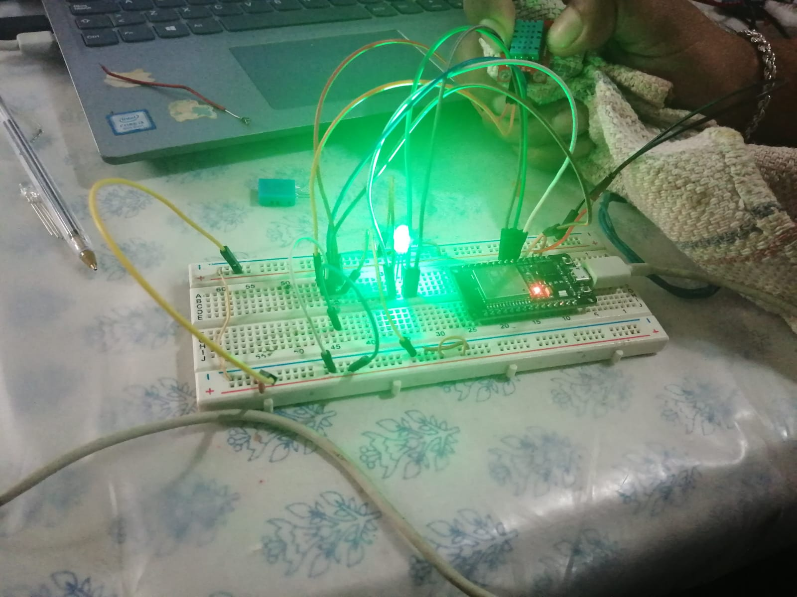

# **Homework.**  

## A3.3 Temperature measurement circuit through a NodeMCU ESP32

> Delivery date: Tuesday, 08 June, 2021.
> 

# Microcontrollers.

## 🏆 A.3.3 Learning activity

Temperature measurement circuit through an ESP32 NodeMCU
___

## 📘 Instructions

- Based on the figure 1, assemble a system, capable of detecting temperature and humidity in the enviroment, through an electronic circuit, using a NodeMCU **ESP32**, and a **Sensor DHT11/DHT22**.
- Every activity or challenge must be done using the **MarkDown style with .md** extension and the VSCode development environment, and must be elaborated as a **single page** document, that is, if the document has images, links or any external document it must be accessed from tags and links, and must be named with the nomenclature  **A3.3_TituloActividad_NombreAlumno.pdf.**
- It is required that the .md contains a tag of the link to the repository of your document in GITHUB, for example **Link to my GitHub** and at the conclusion of the challenge it should be uploaded to github.
- From the **.md** file export a **.pdf** file that should be uploaded to classroom within its corresponding section, serving as evidence of your delivery, since being the **official** platform here you will receive the qualification of your activity.
- Considering that the .PDF file, which was obtained from the .MD file, both must be identical.
- Your repository, in addition to having a **readme**.md file in its root directory, with information such as student data, work team, subject, career, advisor data, and even logo or images, must have a contents section or index, which are actually links or **links to your .md** documents, _avoid using text_ to indicate internal or external links.
- We propose a structure as indicated below, but you can use any other structure that will help you to organize your repository.
  
```
- readme.md
  - blog
    - C3.1_TituloActividad.md
    - C3.2_TituloActividad.md
    - C3.3_TituloActividad.md
    - C3.4_TituloActividad.md
    - C3.5_TituloActividad.md
    - C3.6_TituloActividad.md
    - C3.7_TituloActividad.md
    - C3.8_TituloActividad.md
  - img
  - docs
    - A3.1_TituloActividad.md
    - A3.2_TituloActividad.md
    - A3.3_TituloActividad.md
```

### Sources of support to develop the activity:

   - [x] [Random Nerd Tutorial Touch pin](https://randomnerdtutorials.com/esp32-touch-pins-arduino-ide/)

   - [x] [Example of circuit with LED RGB ](https://i0.wp.com/saber.patagoniatec.com/wp-content/uploads/2019/07/led-rgb-catodo-anado-comun.jpg)

___

## ✏️ Development

1..Use the following list of materials for the elaboration of the activity

|  Quantity | Description                                                                                                                                                                                                                           |
| -------- | ------------------------------------------------------------------------------------------------------------------------------------------------------------------------------------------------------------------------------------- |
| 1        | [Temperature and humidity sensor DHT11](https://articulo.mercadolibre.com.mx/MLM-664315278-sensor-de-temperatura-y-humedad-dht11-cjumpers-arduino-pic-_JM#position=1&type=item&tracking_id=b203e8cd-c375-429a-9b75-8c57e8b35386) o [DHT22](https://articulo.mercadolibre.com.mx/MLM-608839646-sensor-de-temperatura-y-humedad-dht22-_JM?matt_tool=48904454&matt_word=&matt_source=google&matt_campaign_id=11714912137&matt_ad_group_id=113017550359&matt_match_type=&matt_network=g&matt_device=c&matt_creative=482511924687&matt_keyword=&matt_ad_position=&matt_ad_type=pla&matt_merchant_id=278747651&matt_product_id=MLM608839646&matt_product_partition_id=353037831509&matt_target_id=pla-353037831509&gclid=Cj0KCQjwh_eFBhDZARIsALHjIKf9L1OrV2kbvbHYn_0K_5Fuf7Eq00o5uvaNGMy8vGRpDv8y0LEyPugaAhxaEALw_wcB) |
| 1        | [Diode led RGB](https://www.steren.com.mx/led-de-colores-rgb.html)                                                                                                                                                                                                                         |
| 1        | [Resistence 4.7 kohms](https://www.electronicaplugandplay.com/componentes-pasivos/resistencias/resistencias-de-carbon/product/92-resistencia-4-7-k-1-4-watt)                                                                                                                                                                                                                 |
| 3        | [Resistences 1 kohm](https://agelectronica.lat/pdfs/textos/R/RC.30E12.PDF)                                                                                                                                                                                                                   |
| 1        | [Voltage source of 5V](https://www.amazon.com.mx/Adaptador-corriente-100-alimentaci%C3%B3n-masajeador/dp/B087LY41PV/ref=asc_df_B087LY41PV/?tag=gledskshopmx-20&linkCode=df0&hvadid=450967569013&hvpos=&hvnetw=g&hvrand=16650618794470437898&hvpone=&hvptwo=&hvqmt=&hvdev=c&hvdvcmdl=&hvlocint=&hvlocphy=9073855&hvtargid=pla-1431055871432&psc=1)                                                                                                                                                                                                               |
| 1        | [NodeMCU ESP32](https://articulo.mercadolibre.com.mx/MLM-587686290-esp32-wifi-bluetooth-42-ble-nodemcu-esp8266-libro-gratis-_JM#position=1&type=item&tracking_id=84a6234b-5016-47eb-9950-39b49846ca72)                                |
| 1        | [BreadBoard](https://www.amazon.com.mx/Deke-Home-Breadboard-distribuci%C3%B3n-electr%C3%B3nica/dp/B086C9HK7V/ref=sr_1_22?__mk_es_MX=%C3%85M%C3%85%C5%BD%C3%95%C3%91&dchild=1&keywords=breadboard&qid=1599003455&sr=8-22)                                                                                                                                                                                                                            |
| 1        | [Jumpers M/M](https://www.amazon.com.mx/ELEGOO-Macho-Hembra-Macho-Macho-Hembra-Hembra-Protoboard/dp/B06ZXSQ5WG/ref=sr_1_1?__mk_es_MX=%C3%85M%C3%85%C5%BD%C3%95%C3%91&dchild=1&keywords=jumper+wires&qid=1599003519&sr=8-1)                                                                                                                                                                                                                           |
       

2. Based on the images shown in **Figures 1**, assemble the circuit into a single electronic circuit, in such a way as to obtain a system capable of fulfilling the instructions requested above for this activity.
  

<p align="center"> 
    <strong>Figure 1 Circuit ESP32 and Sensor DHT</strong></p>
    <p align="center">  
    
</p>

3.  Once the previous circuit is assembled, add a LED RGB and elaborate the program that allows for the  LED RGB to work as an indicator of the following conditions:
    - The temperature sensor will be sensing at every moment, sending the registered value in the serial terminal, for example  "Ambience temperature: 25 degrees" and the **LED RGB** will turn into a green color.
    - When the temperature sensor registers a value of ~20% above the ambience temperature, it should show the message "High temperature: ? degrees" and the  **LED RGB** will turn into a red color.
    -  When the temperature sensor registers a value of  ~20% below the ambience temperature, it should show the message "Low temperature: ? degrees" and the  **LED RGB** will turn into a blue color. 

4. Place here evidence that you consider important during the development of the activity.

## Code
```c++

// La librería DHT es la que permite la comunicación con los sensores DHT11.
#include "DHT.h" 

// Pin donde está conectado el sensor (pin 4 del ESP32).
#define DHTPIN 4 

// Define el tipo de sensor, DHT 11.
#define DHTTYPE DHT11   

// Inicializamos el sensor DHT11 con el objeto llamado dht, de tipo DHT, asignando el tipo de 
// sensor y el pin.
DHT dht(DHTPIN, DHTTYPE);

// Definimos los pines (para el Led RGB) primera punta rojo 16, segunda no se define es negativo (-), 
// tercera verde 17, cuarta punta azul 5,  y canales para los PWM (Modulación por Ancho de Pulsos).
const int ledRojo = 16;
const int ledCanalRojo = 0;
const int ledVerde= 17;
const int ledCanalVerde= 1;
const int ledAzul= 5;
const int ledCanalAzul = 2;

// Definimos la frecuencia y resolución para los PWM.
const int freq = 5000;
const int resolucion = 8;

void setup() {
  // Inicia comunicación serial.
  Serial.begin(9600); 
  
  // Imprime un mensaje de prueba para cada pinMode (permite configurar a cada pin, de forma 
  // individual, en este caso como salida).
  pinMode(ledRojo, OUTPUT);
  pinMode(ledVerde, OUTPUT);
  pinMode(ledAzul, OUTPUT);
  
  // Asociar a 3 canales PWM internos del microcontrolador un canal, una frecuencia de conmutación 
  // y una resolución.
  ledcSetup(ledCanalRojo, freq, resolucion);
  ledcSetup(ledCanalVerde, freq, resolucion);
  ledcSetup(ledCanalAzul, freq, resolucion);
  
  // Asociar cada uno de los tres canales creados a un Pin de la placa para que las señales de 
  // cada canal se ejecuten por el Pin deseado.
  ledcAttachPin(ledRojo, ledCanalRojo);
  ledcAttachPin(ledVerde, ledCanalVerde);
  ledcAttachPin(ledAzul, ledCanalAzul);

  Serial.println("Mensaje de prueba..."); 
  
  // Iniciamos el dht.
  dht.begin();
}


void loop() {
  // Esperamos 2 segundos para continuar, ya que el sensor tiene como máximo son 2 segundos lo que
  // puede tardar el sensor en leer los valores.
  delay(2000);
  
  // Guarda el valor de la lectura de humedad en una variable float 
  float h = dht.readHumidity();

  // Guarda el valor de la lectura de temperatura en una variable float, la que por defecto esta 
  // en Celsius
  float t = dht.readTemperature();

  // Este if es para saber si hubo algún fallo en la lectura del sensor DHT11, ya sean de conexión 
  // u otra cosa.  
  if (isnan(h) || isnan(t)) {
    Serial.println("Error de lectura...");
    return;
  }
  
  // La temperatura deberá de estar entre 16 y 24 para que el sensor este en verde.
  if(t > 16 && t < 24){
    Serial.print("Temperatura: ");
    Serial.print(t);
    Serial.println(" grados C");
    ledcWrite(ledCanalRojo,  0);
    ledcWrite(ledCanalVerde, 255);
    ledcWrite(ledCanalAzul,  0);
  } 

  // La temperatura deberá ser mayor a 24 para que el sensor este en rojo.
  else if( t >= 24){
    Serial.print("Temperatura alta: ");
    Serial.print(t);
    Serial.println(" grados C");
    ledcWrite(ledCanalRojo,  255);
    ledcWrite(ledCanalVerde, 0);
    ledcWrite(ledCanalAzul,  0);
  } 

  // La temperatura deberá ser menor a 16 para que el sensor este en azul.
  else {
    Serial.print("Temperatura baja: ");
    Serial.print(t);
    Serial.println(" grados C");
    ledcWrite(ledCanalRojo,  0);
    ledcWrite(ledCanalVerde, 0);
    ledcWrite(ledCanalAzul,  255);
  }
  
  Serial.println();
}

```
1. [ESP32 Capacitive Touch Sensor Pins with Arduino IDE](https://randomnerdtutorials.com/esp32-touch-pins-arduino-ide/)
2. [DHT11 Sensor de humedad y temperatura en 10 minutos](https://hetpro-store.com/TUTORIALES/sensor-dht11/)
3. [Cómo utilizar el sensor DHT11 para medir la temperatura y humedad con Arduino](https://programarfacil.com/blog/arduino-blog/sensor-dht11-temperatura-humedad-arduino/)
4. [ESP32 with DHT11/DHT22 Temperature and Humidity Sensor using Arduino IDE](https://randomnerdtutorials.com/esp32-dht11-dht22-temperature-humidity-sensor-arduino-ide/?fbclid=IwAR0tZ756y0ppYRZakRaVRY5ImPLodxGCEZvxGc_B2Kef9lg8kKx9qW2-M98)
5. [TUTORIAL SENSOR DE TEMPERATURA Y HUMEDAD DHT11 Y DHT22](https://naylampmechatronics.com/blog/40_tutorial-sensor-de-temperatura-y-humedad-dht11-y-dht22.html)
6. [DESARROLLO DE UN SISTEMA DE CONTROL DE INVERSOR BASADO EN MICROCONTROLADOR PARA UN BANCO DE ENSAYOS DE ACCIONAMIENTOS ELÉCTRICOS](https://riunet.upv.es/bitstream/handle/10251/123114/20904350H_TFG_15596466342997165944694603949574.pdf?sequence=2&isAllowed=y)

5. Insert images of **evidence** such as team meetings held for the development of the activity.

<p align="center">   
    
</p>
  
  <p align="center">   
    
</p>
  
  <p align="center">   
    
</p>

<p align="center">   
    
</p>

<p align="center">   
    
</p>


___

## Evidences

 

___

## Conclusions for each of the team members.

 🥞 **Shaaron Porras Rangel:** 

Analyzing all the practices that we have done so far I think it is the one that has been the most difficult for us to perform, we had to try a DHT11 to make the connections since at the beginning it marked an error in the DHT connection, in the same way we tested other RGB LEDs to make sure that the error was in the connection and not in the Led. We also tried doing the practice with less resistors as the RGB Led light was too dim due to the resistors and it actually works quite well.

 🐕 **Jesus Xavier Lopez Galaz:** 


 🧀 **Karla Dinora Urrea Soto:**

This practice had as an objective learning to handle the sensor DHT11 for different conditions according to the temperature it registers, we are also using the NodeMCU ESP32 for the second time so we get to learn other functions for it to be used. It was interesting seeing how the LED behaves depending on how the temperature changes. I'm hoping I get to practice with different conditions in other occasions so that we learn how to program according to different situations just as it occured during this practice.

 🐶 **Carlos Fernando Leal Oliva:**


___

## 💣 Rubric


| **Standards** | **Description**                                                                                    | **Score** |
| ------------- | -------------------------------------------------------------------------------------------------- | --------- |
| Instructions  | Is each of the items listed in the Instructions section met?                                        | 10        |
| Development   | Did you respond to each of the points requested in the development of the activity?                 | 60        |
| Demonstration | Does the student introduce him/herself during the explanation of the functionality of the activity? | 20        |
| Conclusions   | Is a personal opinion of the activity included for each team member?                                | 10        |


___

## Equipment repositories

 🥞 [15211343 - Shaaron Porras Rangel](https://github.com/ShaaronPR/Tareas)

 🐕 [18212208 - Jesus Xavier Lopez Galaz](https://github.com/LopezJesus/Sistemas-Programables)

 🧀 [17211568 - Karla Dinora Urrea Soto](https://github.com/Karldin11/SistemasProgramables)

 🐶 [18212205 - Carlos Fernando Leal Oliva](https://github.com/FernandoOliva18212205/SistemasProgramables)

 📁 [Link to group activity](https://github.com/ShaaronPR/Sistemas-Programables/blob/main/A3.3_NombreApellido_Sistematicos.md)


 🏠 [Home](https://github.com/ShaaronPR/Sistemas-Programables)


