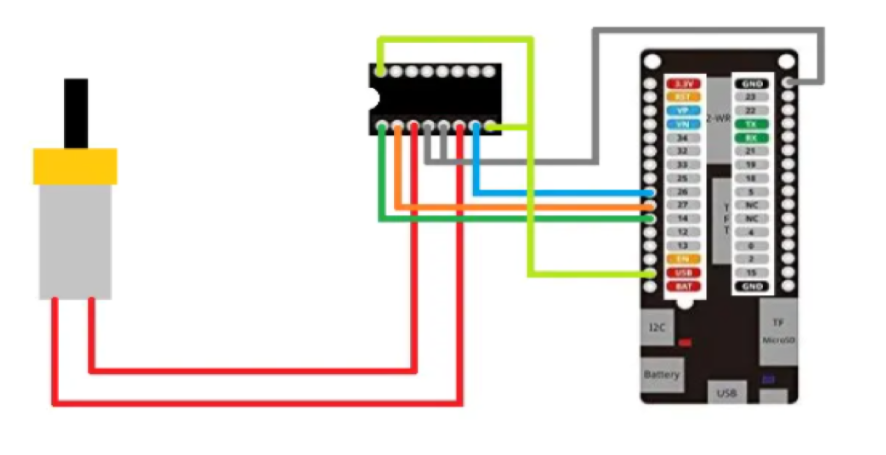

# **Homework.**  

## A4.1 Control circuit to activate and deactivate a DC motor, using NodeMCU ESP32 via Bluetooth

> Delivery date: Monday, 14 June, 2021.
> 

# Microcontrollers programming.

## 🏆 A.4.1 Learning activity

Control circuit to activate and deactivate a DC motor, using NodeMCU ESP32 by means of Bluetooth
___

## 📘 Instructions

___

### Sources of support to develop the activity

- [x] [Random Nerd Tutorial DHT Humedad y temperatura](https://randomnerdtutorials.com/esp32-dht11-dht22-temperature-humidity-sensor-arduino-ide/)
- [x] [Motor DC con IC L293 y ESP32](https://www.hackster.io/Oniichan_is_ded/l293d-with-esp32-wemos-lolin-d32-v2-hacked-edition-ea2086)

___


## ✏️ Development

1. Use the following list of materials for the elaboration of the activity. 

| Quantity | Description                                                                                                                                                                                                                |
| -------- | -------------------------------------------------------------------------------------------------------------------------------------------------------------------------------------------------------------------------- |
| 1        | [IC L293D](https://www.mouser.mx/ProductDetail/STMicroelectronics/L293D?qs=gr8Zi5OG3MgMJ1ICDzL[…]term=L293D&utm_content=STMicroelectronics&source=Datasheets360)             |
| 1        | [5V voltage supply](https://www.amazon.com.mx/Adaptador-corriente-100-alimentaci%C3%B3n-masajeador/dp/B087LY41PV/ref=asc_df_B087LY41PV/?tag=gledskshopmx-20&linkCode=df0&hvadid=450967569013&hvpos=&hvnetw=g&hvrand=16650618794470437898&hvpone=&hvptwo=&hvqmt=&hvdev=c&hvdvcmdl=&hvlocint=&hvlocphy=9073855&hvtargid=pla-1431055871432&psc=1)                                                                                                                                                                                                    |
| 1        | [NodeMCU ESP32](https://www.amazon.com.mx/ESP-32-ESP-32S-ESP-WROOM-32-ESP32-S-desarrollo/dp/B07TBFC75Z/ref=sr_1_2?__mk_es_MX=%C3%85M%C3%85%C5%BD%C3%95%C3%91&dchild=1&keywords=esp32&qid=1599003438&sr=8-2)                |
| 1        | [BreadBoard](https://www.amazon.com.mx/Deke-Home-Breadboard-distribuci%C3%B3n-electr%C3%B3nica/dp/B086C9HK7V/ref=sr_1_22?__mk_es_MX=%C3%85M%C3%85%C5%BD%C3%95%C3%91&dchild=1&keywords=breadboard&qid=1599003455&sr=8-22)   |
| 1        | [Jumpers M/M](https://www.amazon.com.mx/ELEGOO-Macho-Hembra-Macho-Macho-Hembra-Hembra-Protoboard/dp/B06ZXSQ5WG/ref=sr_1_1?__mk_es_MX=%C3%85M%C3%85%C5%BD%C3%95%C3%91&dchild=1&keywords=jumper+wires&qid=1599003519&sr=8-1) |
| 1| [Motor Reductor](http://www.master.com.mx/img/fichas/AR-DCMOTOR.pdf) |

2. Based on the images shown in Figure 1, assemble an electronic circuit, in order to obtain a system capable of fulfilling the following instructions to obtain a system capable of complying with the following instructions:
    - By means of the application "Serial Bluetooth terminal" that can be downloaded from the Google Play Store or any other you consider, you will have to control the start and shutdown of a DC motor, i.e. there will be two requests, one of which will represent the "START" and the other option "STOP".
    - The motor must be able to rotate clockwise for 5 seconds, at the end of this time it must brake for 1 second and reverse its rotation for another 5 seconds. time it must brake for 1 second and will reverse its rotation for another 5 seconds.

<p align="center"> 
    <strong>Figura 1 Circuito ESP32 IC L293 Motor DC</strong></p>
    <p align="center">  
    
</p>

3. Place here the image of the assembled circuit.

<p align="center">   
    
</p>

<p align="center">   
    
</p>

4. Place the program created in the Arduino environment here.

## Code
```c++

// La biblioteca BluetoothSerial ESP32, es para enviar datos a una conexión Serial emulada, 
// operando sobre Bluetooth clásico.
#include "BluetoothSerial.h"

// Se comprueba si el BT está activado.
#if !defined(CONFIG_BT_ENABLED) || !defined(CONFIG_BLUEDROID_ENABLED)
#error Bluetooth is not enabled! Please run `make menuconfig` to and enable it
#endif

// Se crea una instancia de la librería de BluetoothSerial (objeto Bluetooth)
BluetoothSerial SerialBT;

// Variables del motor
Int contador = 0;
bool banderaGiro = false;
char caracter;
bool banderaStop = false;
int PinMotor1 = 16;
int PinMotor2 = 17;
int PinEnable = 4;

void setup() {
  Serial.begin(115200);
  pinMode(PinMotor1, OUTPUT);
  pinMode(PinMotor2, OUTPUT);
  pinMode(PinEnable, OUTPUT);
  digitalWrite(PinEnable, HIGH);

  // Nombre que se le asigna al ESP32 con BT (Bluetooth device name.)
  SerialBT.begin("ESP32CodeDeve"); 
  Serial.println("The device started, now you can pair it with bluetooth!");
}

void loop() {
  // Si hay algo activo (escrito) en el puerto serial del BT.
  if (SerialBT.available()) {  
    // Obtengo lo que se lee en una variable.
    caracter = SerialBT.read();
  }
  
  // Si el caracter introducido es "1" enciende el motor.
  if(String(caracter) == "1"){ 
  // Indica que lo último dato introducido fue 1
      banderaStop = true; 
    }
	
  // Si es el carácter es 0 se detiene el motor
  if(String(caracter) == "0"){
    contador = 0;
    banderaGiro = false;
    banderaStop = false;
	
	// Deja en LOW el primer pin del motor el pin está a 0 voltios (tarjetas de 5V o de 3.3V)
    digitalWrite(PinMotor1, LOW); 
	
	// Deja en LOW(indicador de potencia) el segundo pin del motor
    digitalWrite(PinMotor2, LOW); 
  }
  
  // Mientras el motor está en funcionamiento y aún no cumple 5 segundos de giro entonces.
  if(banderaStop && contador <= 5){
  
	// Cuando el motor se está moviendo, debemos indicar a donde debera de girar.
	if(contador != 5){
		
		// Cuando la banderaGiro es false, entonces gira en sentido de las manecillas 
		// del reloj y cuando es true, gira en sentido contrario
        if(banderaGiro == false){
		
		// Deja el primer pin en HIGH (para voltajes mayores)
          digitalWrite(PinMotor1, HIGH); 
		  
		// Deja el segundo pin en LOW (para voltajes menores)
          digitalWrite(PinMotor2, LOW); 
        }
		
        if(banderaGiro == true){
          // Se invierten los estados de los pines en comparación a la instrucción anterior
          digitalWrite(PinMotor1, LOW);
          digitalWrite(PinMotor2, HIGH);
        }
		// Incrementa el contador en "1".
        contador++; 
      }
	  
	// Cuando ya giró por 5 segundos (contador = 5), se frena y cambia la dirección.  
    else {
		// Detenemos el motor.
        digitalWrite(PinMotor1, LOW);
        digitalWrite(PinMotor2, LOW);
        
		// Cambiamos la dirección de giro.
        banderaGiro= !banderaGiro;
		
		// Se reestablece la cantidad de giros en 0.
        contador = 0;     
      }   
	  // El motor se queda detenido 1 segundo.
      delay(1000); 
  }  
}

```

5. Place here evidences that you consider important during the development of the activity.

- [ESP32 Arduino: Serial communication over Bluetooth Hello World](https://techtutorialsx.com/2018/03/09/esp32-arduino-serial-communication-over-bluetoth-hello-world/)
- [constantes](https://www.arduino.cc/reference/es/language/variables/constants/constants/)
- [ESP32: Empezando a usar el Bluetooth (SPP)](https://www.electrosoftcloud.com/esp32-empezando-a-usar-el-bluetooth-spp/)

## Evidences


___

## Conclusions for each of the team members.

🥞 **Shaaron Porras Rangel:** 


🐕 **Jesus Xavier Lopez Galaz:** 


🧀 **Karla Dinora Urrea Soto:**


🐶 **Carlos Fernando Leal Oliva:**

___

## 💣 Rubric


| **Standards** | **Description**                                                                                    | **Score** |
| ------------- | -------------------------------------------------------------------------------------------------- | --------- |
| Instructions  | Is each of the items listed in the Instructions section met?                                        | 10        |
| Development   | Did you respond to each of the points requested in the development of the activity?                 | 60        |
| Demonstration | Does the student introduce him/herself during the explanation of the functionality of the activity? | 20        |
| Conclusions   | Is a personal opinion of the activity included for each team member?                                | 10        |


___

## Team repositories

🥞 [15211343 - Shaaron Porras Rangel](https://github.com/ShaaronPR/Tareas)

🐕 [18212208 - Jesus Xavier Lopez Galaz](https://github.com/LopezJesus/Sistemas-Programables)

🧀 [17211568 - Karla Dinora Urrea Soto](https://github.com/Karldin11/SistemasProgramables)

🐶 [18212205 - Carlos Fernando Leal Oliva](https://github.com/FernandoOliva18212205/SistemasProgramables)

📁 [Link to group activity](https://github.com/ShaaronPR/Sistemas-Programables/blob/main/A4.1_NombreApellido_Sistematicos.md)


🏠 [Home](https://github.com/ShaaronPR/Sistemas-Programables)


