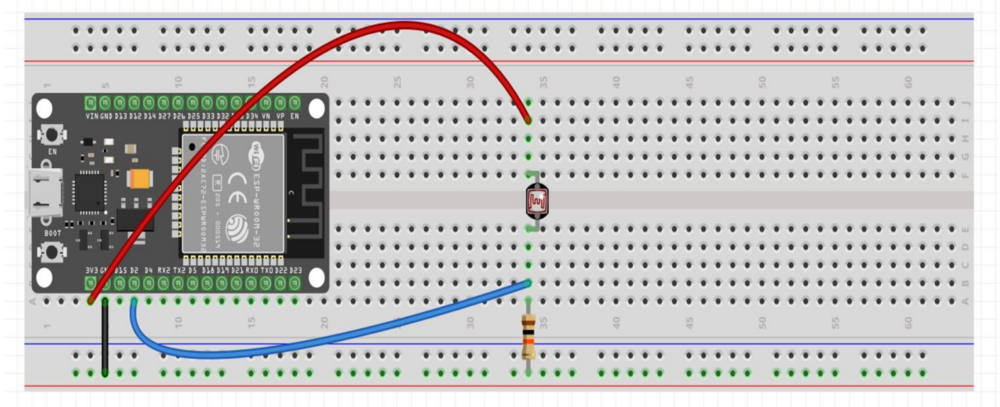

# **Homework.**  

## A4.2 NodeMCU ESP32 light actuation and illumination sensor circuit via Wi-Fi

> Delivery date: Thursday, 17 June, 2021.
> 

# Microcontrollers programming.

## 🏆 A.4.2 Learning activity

NodeMCU ESP32 light actuation and lighting sensor circuit via Wi-Fi
___

## 📘 Instructions

___

### Sources of support to develop the activity

   - [x] [ESP32 Web Server](https://randomnerdtutorials.com/esp32-web-server-arduino-ide/)
   - [x] [LDR con ESP32](https://www.youtube.com/watch?v=A3qcN2mzv0Q)
 
___


## ✏️ Development

1. Use the following list of materials for the elaboration of the activity

| Quantity | Description    |
| -------- | -------------- |
| 1        | [LDR Sensor Module](https://articulo.mercadolibre.com.mx/MLM-623282168-modulo-sensor-de-luz-ldr-_JM)             |
| 1        | [3.3v relay](https://articulo.mercadolibre.com.mx/MLM-657068029-modulo-relevador-relay-1-canal-5v-_JM?matt_tool=48904454&matt_word=&matt_source=google&matt_campaign_id=11714912137&matt_ad_group_id=113017550359&matt_match_type=&matt_network=g&matt_device=c&matt_creative=482511924687&matt_keyword=&matt_ad_position=&matt_ad_type=pla&matt_merchant_id=117474830&matt_product_id=MLM657068029&matt_product_partition_id=353037831509&matt_target_id=pla-353037831509&gclid=Cj0KCQjw8IaGBhCHARIsAGIRRYqDPhPhuSoQAWKjkJCkCVHqJGlWKdYlwNWcDM1MyAKrkjc3GE0lUAoaAgz8EALw_wcB)	|
| 1        | [Bulb](https://euroelectrica.com.mx/descargas/FICHA-TECNICA-TL22075SLD8.pdf)	|
| 1        | [5V voltage supply](https://www.amazon.com.mx/Adaptador-corriente-100-alimentaci%C3%B3n-masajeador/dp/B087LY41PV/ref=asc_df_B087LY41PV/?tag=gledskshopmx-20&linkCode=df0&hvadid=450967569013&hvpos=&hvnetw=g&hvrand=16650618794470437898&hvpone=&hvptwo=&hvqmt=&hvdev=c&hvdvcmdl=&hvlocint=&hvlocphy=9073855&hvtargid=pla-1431055871432&psc=1)                                                  						|
| 1        | [NodeMCU ESP32](https://www.amazon.com.mx/ESP-32-ESP-32S-ESP-WROOM-32-ESP32-S-desarrollo/dp/B07TBFC75Z/ref=sr_1_2?__mk_es_MX=%C3%85M%C3%85%C5%BD%C3%95%C3%91&dchild=1&keywords=esp32&qid=1599003438&sr=8-2)                |
| 1        | [BreadBoard](https://www.amazon.com.mx/Deke-Home-Breadboard-distribuci%C3%B3n-electr%C3%B3nica/dp/B086C9HK7V/ref=sr_1_22?__mk_es_MX=%C3%85M%C3%85%C5%BD%C3%95%C3%91&dchild=1&keywords=breadboard&qid=1599003455&sr=8-22)   |
| 1        | [Jumpers M/M](https://www.amazon.com.mx/ELEGOO-Macho-Hembra-Macho-Macho-Hembra-Hembra-Protoboard/dp/B06ZXSQ5WG/ref=sr_1_1?__mk_es_MX=%C3%85M%C3%85%C5%BD%C3%95%C3%91&dchild=1&keywords=jumper+wires&qid=1599003519&sr=8-1) |

2. Based on the image shown in Figure 1, assemble an electronic circuit and add an LED to one of the terminals of the device, in such a way that you can obtain a system capable of fulfilling the following instructions:

    - The NodeMCU shall be used as a standalone Web server, which shall provide a visual interface, which will display an image representing an "ON and OFF" behavior depending on the ambient lighting condition.
    - The illumination sensor should be measuring the amount of light in the environment.
    - When the LDR sensor detects the absence of light, it should show an "ON" status on the Web interface, otherwise it should show an "OFF" status.
    - To the circuit of figure 1 a relay must be added in series with a light bulb, which will be activated in the opposite condition to the "ON" and "OFF" state, i.e. once the sensor detects little or no illumination it will activate the relay and therefore turn on the light bulb, and otherwise it will turn it off.

[Fuente de apoyo Random Nerd Tutorial](https://randomnerdtutorials.com/esp32-web-server-arduino-ide/)

<p align="center"> 
    <strong>Figura 1 Circuito ESP32 Sensor LDR iluminacion</strong></p>
    <p align="center">  
    
</p>

3. Place here the image of the assembled circuit.

4. Place in this place the program created within the Arduino environment.

## Code
```c++

Arduino

```

5. Place here evidences that you consider important during the development of the activity.

## Evidences


___

## Conclusions for each of the team members.

🥞 **Shaaron Porras Rangel:** 


🐕 **Jesus Xavier Lopez Galaz:** 


🧀 **Karla Dinora Urrea Soto:**


🐶 **Carlos Fernando Leal Oliva:**

___

## 💣 Rubric


| **Standards** | **Description**                                                                                    | **Score** |
| ------------- | -------------------------------------------------------------------------------------------------- | --------- |
| Instructions  | Is each of the items listed in the Instructions section met?                                        | 10        |
| Development   | Did you respond to each of the points requested in the development of the activity?                 | 60        |
| Demonstration | Does the student introduce him/herself during the explanation of the functionality of the activity? | 20        |
| Conclusions   | Is a personal opinion of the activity included for each team member?                                | 10        |


___

## Team repositories

🥞 [15211343 - Shaaron Porras Rangel](https://github.com/ShaaronPR/Tareas)

🐕 [18212208 - Jesus Xavier Lopez Galaz](https://github.com/LopezJesus/Sistemas-Programables)

🧀 [17211568 - Karla Dinora Urrea Soto](https://github.com/Karldin11/SistemasProgramables)

🐶 [18212205 - Carlos Fernando Leal Oliva](https://github.com/FernandoOliva18212205/SistemasProgramables)

📁 [Link to group activity](https://github.com/ShaaronPR/Sistemas-Programables/blob/main/A4.2_NombreApellido_Sistematicos.md)


🏠 [Home](https://github.com/ShaaronPR/Sistemas-Programables)


