# **Homework.**  

## A5.2 Final Activity Identifying the color of an object

> Delivery date: Friday, 25 June, 2021.
> 

# Communication ports and buses for microcontrollers.

## 🏆 A.5.2 Learning activity

Object color sensing and actuation system and visual interface
___

## 📘 Instructions

- Perform a color identification system using a TCS34725 RGB sensor, a nodeMCU ESP32, an SG90 Servomotor actuator, any communication protocol and a visual interface that
it can be developed by the team or supported by others such as Node-red for example.

- Any activity or challenge must be carried out using the **MarkDown style with an .md extension** and the environmentVSCode development process, it must be prepared as a **single page** document, that is, if the document with images, links or any external document must be accessed from tags and links, and must be named with the nomenclature **A5.2_NombreApellido_Equipo.pdf**.

- It is a requirement that the .md contains a tag of the link to the repository of your document in GITHUB, for example **Link to my GitHub** and at the end of the challenge it should be uploaded to github.

- From the **.md** file export a **.pdf** file that must be uploaded to the classroom within its section corresponding, serving as evidence of its delivery, since being the **official** platform here it is Allow qualification of your activity.

- Considering that the .PDF file, which was obtained from the .MD file, both must be identical.

- Your repository in addition to having a **readme**.md file inside your root directory, with information such as student data, work team, subject, career, advisor data, and even logo or images, it must have a section of contents or index, which really are Links or **links to your .md documents**, avoid using text to indicate internal or external links.

- A structure is proposed as indicated below, however you can use any other to support you to organize your repository.
```
- readme.md
    - blog
        - C5.1_TituloActividad.md
        - C5.2_TituloActividad.md
    - img
    - docs
        - A5.1_TituloActividad.md
        - A5.2_TituloActividad.md
```
___

## ✏️ Development

1. Use the following list of materials for the elaboration of the activity

| Quantity | Description    |
| -------- | -------------- |
| 1        | [Sensor RGB TCS34725](https://articulo.mercadolibre.com.mx/MLM-714606444-modulo-sensor-reconocimiento-de-color-rgb-tcs34725-arduino-_JM?matt_tool=48904454&matt_word=&matt_source=google&matt_campaign_id=11714912137&matt_ad_group_id=113017550359&matt_match_type=&matt_network=g&matt_device=c&matt_creative=482511924687&matt_keyword=&matt_ad_position=&matt_ad_type=pla&matt_merchant_id=117474830&matt_product_id=MLM714606444&matt_product_partition_id=353037831509&matt_target_id=pla-353037831509&gclid=Cj0KCQjw_dWGBhDAARIsAMcYuJzlllD0NizUWLSdaF6xMwqc5NxtDYrjgCzs4awicAnAeKTbQQSdDKAaAnMfEALw_wcB) |
| 1        | [Servomotor SG90](http://www.ee.ic.ac.uk/pcheung/teaching/DE1_EE/stores/sg90_datasheet.pdf)  |
| 1        | [5V voltage supply](https://www.amazon.com.mx/Adaptador-corriente-100-alimentaci%C3%B3n-masajeador/dp/B087LY41PV/ref=asc_df_B087LY41PV/?tag=gledskshopmx-20&linkCode=df0&hvadid=450967569013&hvpos=&hvnetw=g&hvrand=16650618794470437898&hvpone=&hvptwo=&hvqmt=&hvdev=c&hvdvcmdl=&hvlocint=&hvlocphy=9073855&hvtargid=pla-1431055871432&psc=1)                                                                                                                               |
| 1        | [NodeMCU ESP32](https://www.amazon.com.mx/ESP-32-ESP-32S-ESP-WROOM-32-ESP32-S-desarrollo/dp/B07TBFC75Z/ref=sr_1_2?__mk_es_MX=%C3%85M%C3%85%C5%BD%C3%95%C3%91&dchild=1&keywords=esp32&qid=1599003438&sr=8-2)                |
| 1        | [BreadBoard](https://www.amazon.com.mx/Deke-Home-Breadboard-distribuci%C3%B3n-electr%C3%B3nica/dp/B086C9HK7V/ref=sr_1_22?__mk_es_MX=%C3%85M%C3%85%C5%BD%C3%95%C3%91&dchild=1&keywords=breadboard&qid=1599003455&sr=8-22)   |
| 1        | [Jumpers M/M](https://www.amazon.com.mx/ELEGOO-Macho-Hembra-Macho-Macho-Hembra-Hembra-Protoboard/dp/B06ZXSQ5WG/ref=sr_1_1?__mk_es_MX=%C3%85M%C3%85%C5%BD%C3%95%C3%91&dchild=1&keywords=jumper+wires&qid=1599003519&sr=8-1) |

2. Based on the images shown in Figure 1, make a system capable of fulfilling the following conditions:
    
    - The first phase of the activity will consist of, by placing an object in front of the RGB sensor, it will identify what color it is (it is recommended to use Red, Green, and Blue objects for better accuracy), which will show in a visual interface what color was detected.
    - The second phase will consist of adding an actuator and a color identifier supported by a color band as shown in image 1; when the color of the object is known, the actuator should point to the color being detected.


3. Place here the image of the assembled circuit.

<p align="center">   
    
</p>

4. Place in this place the program created within the Arduino environment.

## Code
```c++

#include "WiFi.h"
#include "WebServer.h"
#include <Wire.h>
#include "Adafruit_TCS34725.h"
#include <EasyColor.h>
#include <ESP32Servo.h>

Servo myservo;

int pos = 0; 

Adafruit_TCS34725 tcs = Adafruit_TCS34725(TCS34725_INTEGRATIONTIME_50MS, TCS34725_GAIN_1X); //se crea el objeto del sensor rgb

EasyColor::HSVRGB HSVConverter; 

// Replace with your network credentials
const char* ssid = "Totalplay-58A0";
const char* password = "58A0656284uFT74r";

bool rojo=false;
bool verde=false;
bool azul=false;

// Set web server port number to 80
WebServer server(80);
void setup()
{
  // put your setup code here, to run once:
  Serial.begin(115200); 

  myservo.attach(18);

  Serial.println("Connecting...");
  Serial.println(ssid);
  //Initiate wifi connection
  WiFi.begin(ssid,password);
  //Checking wifi status
  while(WiFi.status() != WL_CONNECTED) {
    delay(1000);
    Serial.println("uwu");
  }
  Serial.println("WiFi connection was succesfull.");
  Serial.print("IP address:");
  Serial.println(WiFi.localIP());

  server.on("/", handle_root);
  server.begin();
  Serial.println("Web server is on.");
  delay(10);

    Serial.println("Buscando módulo TCS34725");
  if (!tcs.begin())
  {
    Serial.println(".");
    while (1) delay(1000);
  }
  Serial.println("Módulo TCS34725 encontrado!");
}
void loop()
{
  server.handleClient();
  handle_root();
}
String HTML(bool red, bool green, bool blue)
{
  String html;
  html +="<!DOCTYPE html>\n";
  html +="<html>\n";
  html +="<head>\n";
  html +="<title>A5.1 Identificación del color de un objeto</title>\n";
  html +="<STYLE type=\"text/css\"> h1 {text-align: center} h2 {text-align:center} </STYLE>\n";
  html +="<meta http-equiv=\"refresh\" content=\"0.8\">\n";
  html +="</head>\n";
  html +="<body style=\"background-color:#D9D9D9;\">\n";
  html +="<h1>Sensor RGB- Color:\n";
  if(red && !green && !blue)
  {
    html +="<center><h2>Color Rojo</h2></center>\n";
  }
  else if(!red && green && !blue)
  {
    html +="<center><h2>Color Verde</h2></center>\n";
  }
  else if(!red && !green && blue)
  {
    html +="<center><h2>Color Azul</h2></center>\n";
  }
  html +="</body>\n";
  html +="</html>\n";

  return html;
}
void enviar_color(float hue){ //este metodo recibe el hue para interpretarlo
 String  mensaje = (String)hue + ",";
  if (hue < 15 || hue > 345 )
  {
      Serial.println("Color: Rojo");
      mensaje += "Rojo";
      myservo.write(45);              // tell servo to go to position in variable 'pos'
  }
  else if (hue > 100&& hue < 150)
  {
      Serial.println("Color: Verde");
      mensaje += "Verde";
      myservo.write(90);              // tell servo to go to position in variable 'pos'
  }
  else if (hue > 180 && hue < 250)
  {
      Serial.println("Color: Azul");
      mensaje += "Azul";
      myservo.write(135);              // tell servo to go to position in variable 'pos'
  }
    Serial.print("Enviando : ");
    Serial.println(mensaje);
    Serial.println();

    delay(1000);

}
void handle_root()
{
    
    uint16_t clear, red, green, blue; //son los colores del sensor rgb

    tcs.setInterrupt(false); //Para que empiece a sensar 
    delay(60); // 50 ms to capture a color
    tcs.getRawData(&red, &green, &blue, &clear); //Conseguir los valores de formato RAW
    tcs.setInterrupt(true);
  
    // rgb measuring
    uint32_t sum = clear;
    float r, g, b;
    r = red; r /= sum; 
    g = green; g /= sum;
    b = blue; b /= sum;
  
    // RGB to bytes
    r *= 256; g *= 256; b *= 256;
    Serial.print("RGB: ");
    Serial.print(r);
    Serial.print(",");
    Serial.print(g);
    Serial.print(",");
    Serial.println(b);

    if(r>g && r>b)
    {
      rojo=true;
      verde=false;
      azul=false;
    }
    else if (g>r && g>b)
    {
      rojo=false;
      verde=true;
      azul=false;
    }
    else if(b>r && b>g)
    {
      rojo=false;
      verde=false;
      azul=true;
    }
    
    rgb in_rgb; 
    hsv out_hsv;
    
    in_rgb.r=r; //se ingresan los valores rgb
    in_rgb.g=g;
    in_rgb.b=b;
  
    out_hsv = HSVConverter.RGBtoHSV(in_rgb, out_hsv);
    Serial.print("HSV: ");
    Serial.print(out_hsv.h);
    Serial.print(",");
    Serial.print(out_hsv.s);
    Serial.print(",");
    Serial.println(out_hsv.v);
    enviar_color(out_hsv.h);

    server.send(200, "text/html", HTML(rojo,verde,azul));
}

```

5. Place here evidences that you consider important during the development of the activity.

[Wifi Scan example fails to compile](https://github.com/espressif/arduino-esp32/issues/103)

[TCS3472 COLOR LIGHT-TO-DIGITAL CONVERTER with IR FILTER](https://cdn-shop.adafruit.com/datasheets/TCS34725.pdf)

[A look at the TCS34725 Color sensor with various examples](http://www.electronicprojects.net/articles/a-look-at-the-tcs34725-color-sensor-with-various-examples.php)

[Using Servo Motors with ESP32](https://dronebotworkshop.com/esp32-servo/)

[ESP32 desde Cero - Tutorial 6: Servidor Web (WebServer)](https://www.luisllamas.es/arduino-sensor-color-rgb-tcs34725/)

[MEDIR VALORES RGB CON ARDUINO Y SENSOR DE COLOR TCS34725](https://www.luisllamas.es/arduino-sensor-color-rgb-tcs34725/)

<p align="center">   
    
</p>

<p align="center">   
    
</p>

<p align="center">   
    
</p>

<p align="center">   
    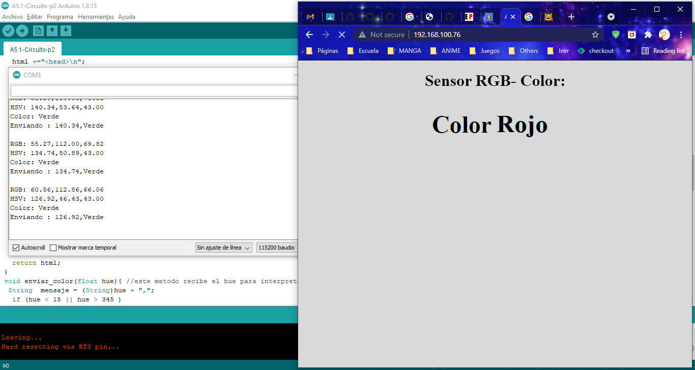
</p>

<p align="center">   
    
</p>

<p align="center">   
    
</p>

<p align="center">   
    
</p>


## Evidences

<p align="center">   
    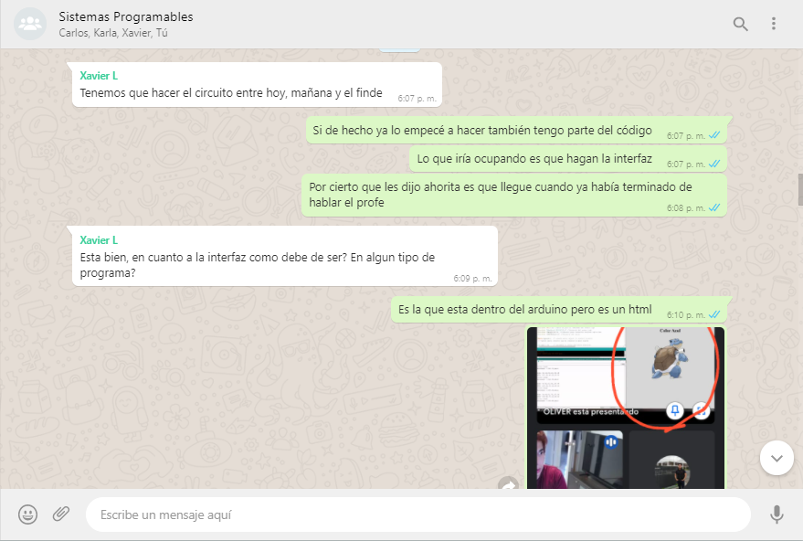
</p>

<p align="center">   
    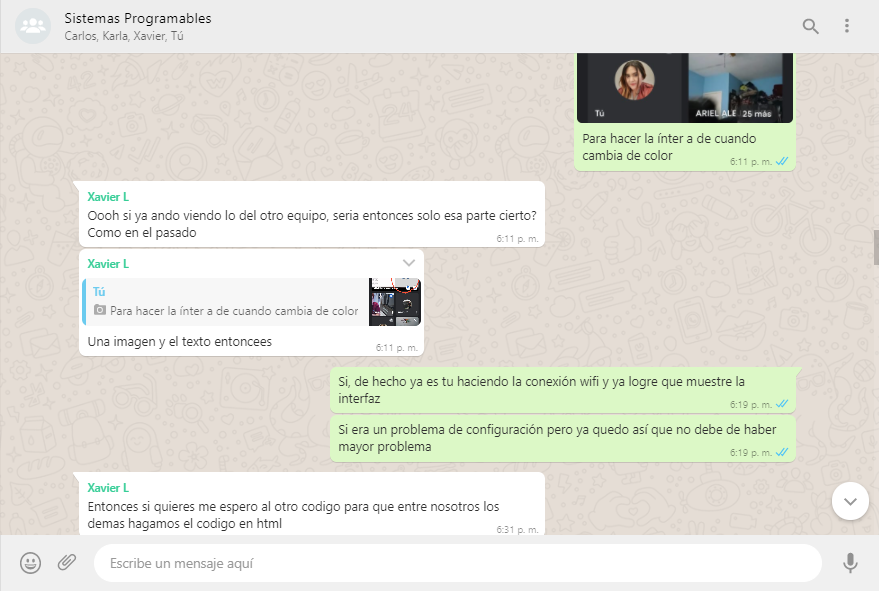
</p>

<p align="center">   
    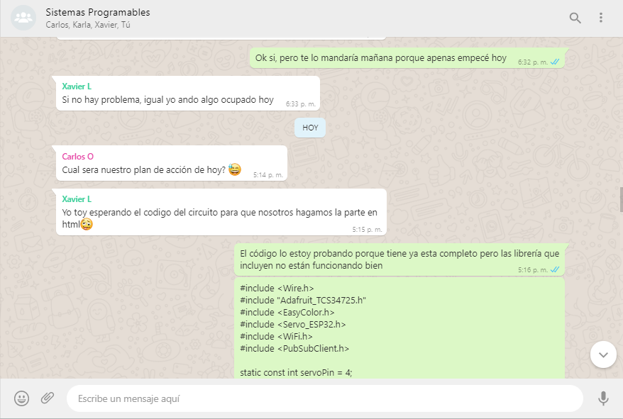
</p>

<p align="center">   
    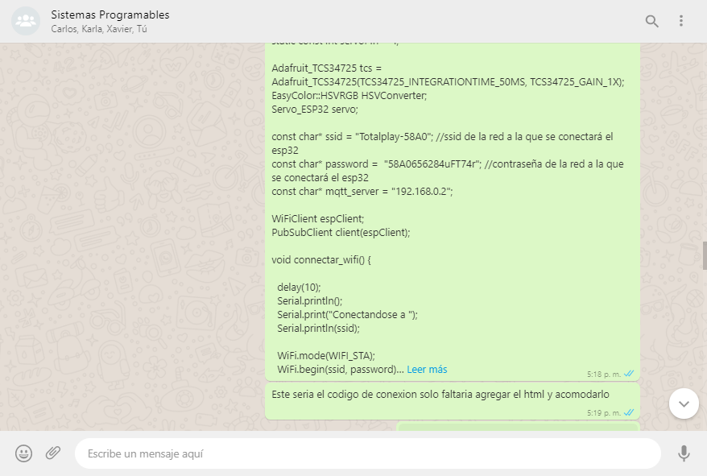
</p>

<p align="center">   
    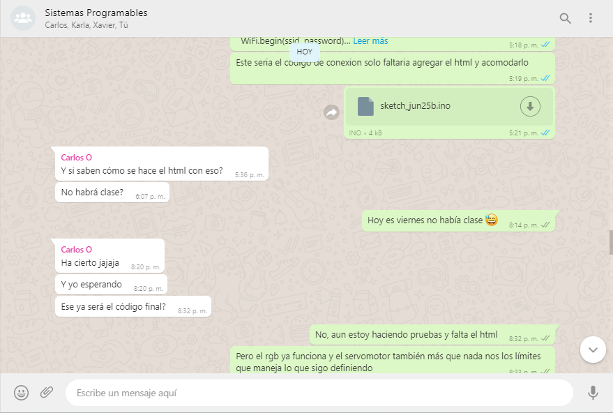
</p>

<p align="center">   
    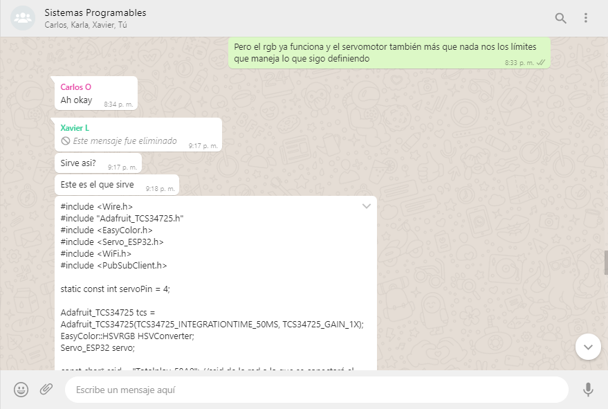
</p>

<p align="center">   
    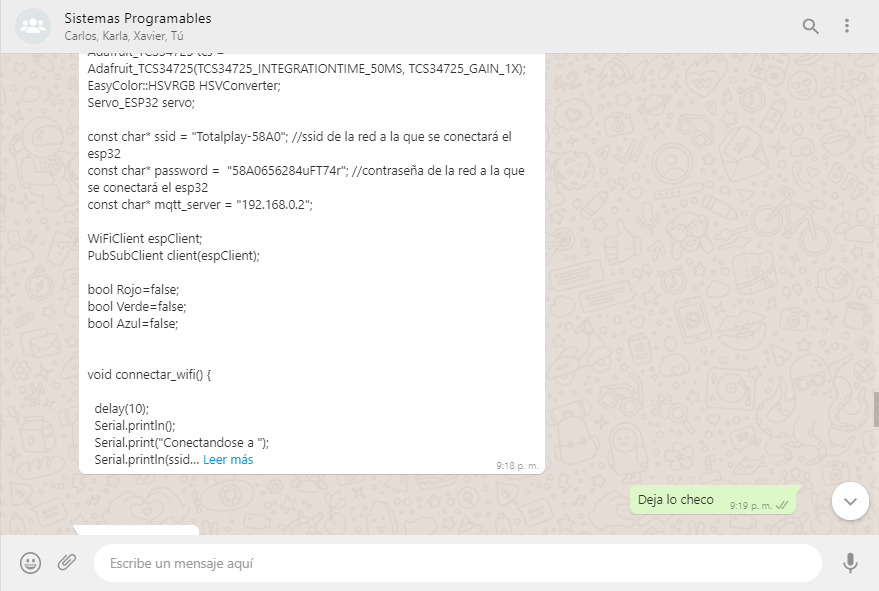
</p>

<p align="center">   
    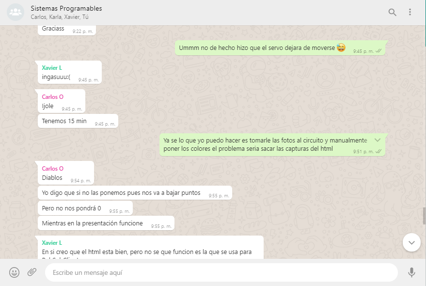
</p>

<p align="center">   
    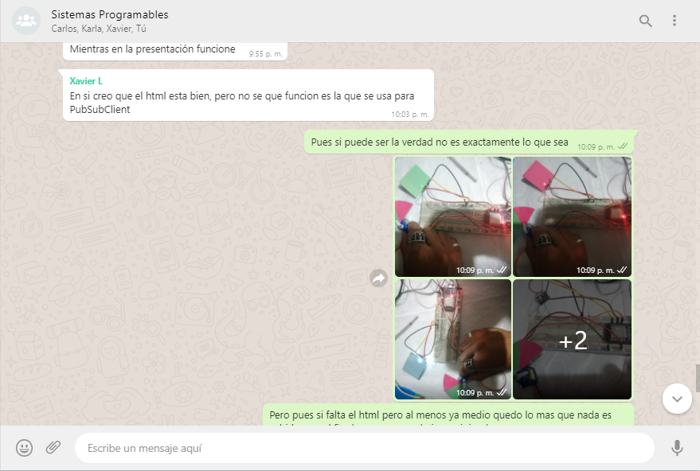
</p>

<p align="center">   
    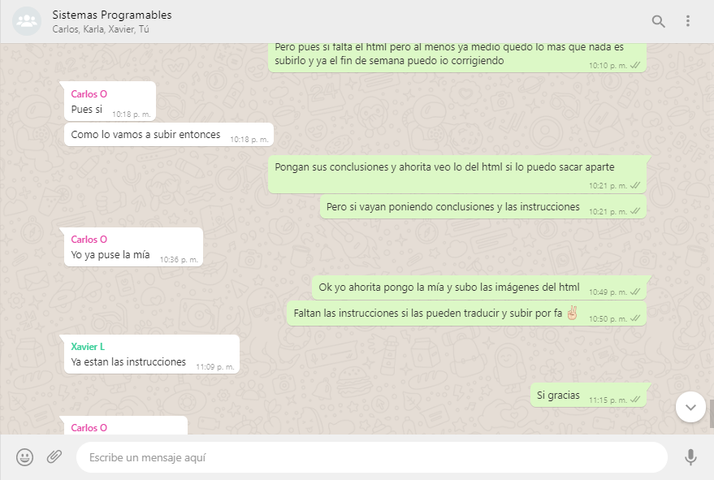
</p>

<p align="center">   
    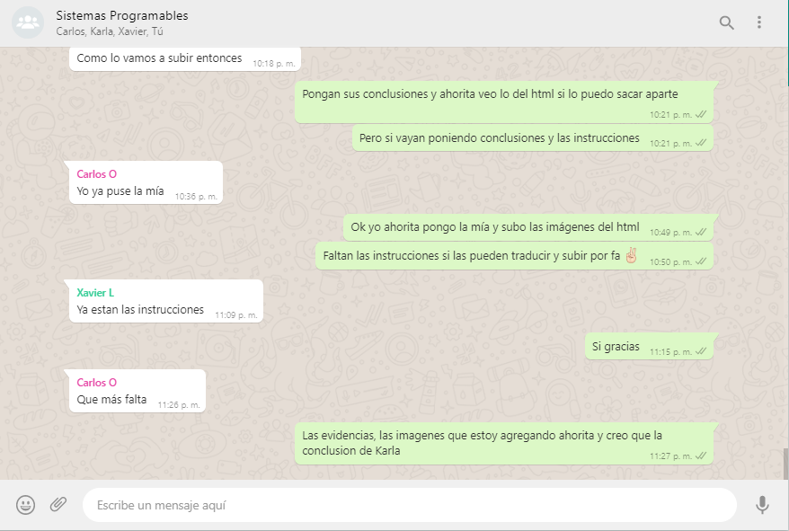
</p>

6. For the demonstration of the activity more than one object should be used in order to cover at least three colors.

___

## Conclusions for each of the team members.

🥞 **Shaaron Porras Rangel:** 

During practice we carried out tests of the components separately to check how each one works and we could see that their individual handling (obviously combined with the ESP32) is quite simple and there are many examples of how they are handled, however when combining the 4 elements, the RGB sensor, the SG90 servo motor, the ESP32 and the web interface, this really gave us many problems since sometimes the servo motor did not work and other times the interface, in the end we were able to solve it although risking the response time already that for everything to work in complete harmony we had to slow down its physical-interface response time. It was very interesting to handle all these elements together, but they gave us a lot of problems.

🐕 **Jesus Xavier Lopez Galaz:** 

In the first place, it should be noted that this was the most difficult practice of all since we had to fully involve ourselves with the knowledge that we have been acquiring throughout this course, but this practice was quite interesting and fun because in a quite way In full, we can see how the analog part, the digital part and the internet part can be implemented in a solid circuit, also with quite interesting applications since it could be said that this is something like a precursor of much more advanced options such as finger scanners. fingerprint or retina, in addition to this it is quite important to identify how the subject in general has helped me to understand a little more about the world of electronics as well as the programming of different devices in this field and to use other types of tools.

🧀 **Karla Dinora Urrea Soto:**


🐶 **Carlos Fernando Leal Oliva:**

This final activity seemed to me the most difficult of all, also one of the most interesting, seeing how an RGB sensor works I did not know that these existed and neither the way in which we could apply them which made the activity increase my interest, also Creating the interface was also something new to be able to see how the sensor reacted, when it reacts it shows us what it detects and using the interface it becomes easier to use it, assembling the circuit was complicated like creating the code but as a team We managed to solve it, I also complemented my knowledge of how the ESP module works and what its functions are, it has many that we saw throughout the semester and in this way we managed to conclude
___

## 💣 Rubric


| **Standards** | **Description**                                                                                    | **Score** |
| ------------- | -------------------------------------------------------------------------------------------------- | --------- |
| Instructions  | Is each of the items listed in the Instructions section met?                                        | 10        |
| Development   | Did you respond to each of the points requested in the development of the activity?                 | 60        |
| Demonstration | Does the student introduce him/herself during the explanation of the functionality of the activity? | 20        |
| Conclusions   | Is a personal opinion of the activity included for each team member?                                | 10        |


___

## Team repositories

🥞 [15211343 - Shaaron Porras Rangel](https://github.com/ShaaronPR/Tareas)

🐕 [18212208 - Jesus Xavier Lopez Galaz](https://github.com/LopezJesus/Sistemas-Programables)

🧀 [17211568 - Karla Dinora Urrea Soto](https://github.com/Karldin11/SistemasProgramables)

🐶 [18212205 - Carlos Fernando Leal Oliva](https://github.com/FernandoOliva18212205/SistemasProgramables)

📁 [Link to group activity](https://github.com/ShaaronPR/Sistemas-Programables/blob/main/A5.1_NombreApellido_Sistematicos.md)


🏠 [Home](https://github.com/ShaaronPR/Sistemas-Programables)


